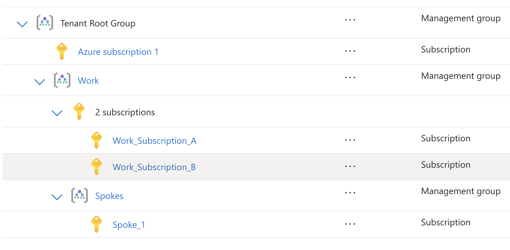

# Azure Hub-Spoke Infrastructure with Private Link

This project implements a secure hub-and-spoke network architecture across multiple Azure subscriptions with centralized private DNS management.

## 🧠 Architecture Overview



- **Hub (Work_Subscription_A)**: Centralized networking and DNS management
- **Spoke (Spoke_1)**: Workload subscriptions with VMs and storage
- **Cross-subscription VNet peering** for secure connectivity
- **Centralized private DNS zones** in hub for Azure services
- **Azure policies** preventing privatelink DNS zones in spokes

## Project Structure

```
├── modules/                    # Reusable Terraform modules
│   ├── hub/                   # Hub infrastructure module
│   ├── spoke/                 # Spoke infrastructure module
│   └── policies/              # Azure policy module
├── environments/              # Environment-specific configurations
│   ├── hub/                   # Hub deployment
│   └── spoke-1/               # Spoke-1 deployment
├── scripts/                   # Helper scripts
└── docs/                      # Documentation
```

## Prerequisites

1. Azure CLI installed and configured
2. Terraform >= 1.0
3. Appropriate permissions in both subscriptions
4. Service Principal with cross-subscription access

##  🚀 Quick Start

1. **Deploy Hub Infrastructure**:
   ```bash
   cd environments/hub
   ./deploy.sh
   ```

2. **Deploy Spoke Infrastructure**:
   ```bash
   cd environments/spoke-1
   ./deploy.sh
   ```

3. **Test VM Storage Access**:
   ```bash
   ./scripts/test-storage-access.sh
   ```

## Features

- ✅ Cross-subscription hub-spoke networking
- ✅ Centralized private DNS resolution
- ✅ Private endpoint connectivity for storage
- ✅ VM managed identity with storage access
- ✅ Azure policy governance
- ✅ Helper scripts for storage operations

See `docs/` directory for detailed deployment and usage instructions.