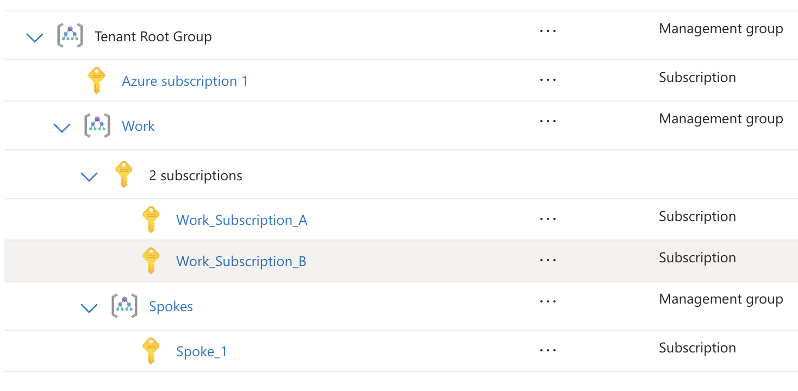

# Hub-Spoke Architecture Documentation

## Overview

This document describes the hub-and-spoke network architecture implemented across multiple Azure subscriptions, providing centralized DNS management and secure private connectivity.

## Subscription Layout



The infrastructure is deployed across the subscription structure shown above, with the hub in Work_Subscription_A and spokes distributed across dedicated subscriptions.

## Architecture Diagram

```
┌─────────────────────────────────────────────────────────────────┐
│                     Work_Subscription_A (Hub)                   │
│  ┌────────────────────────────────────────────────────────────┐ │
│  │                    Hub VNet (10.0.0.0/16)                  │ │
│  │                                                            │ │
│  │  ┌─────────────────┐    ┌────────────────────────────────┐ │ │
│  │  │  Gateway Subnet │    │         DNS Subnet             │ │ │
│  │  │   10.0.1.0/24   │    │        10.0.2.0/24             │ │ │
│  │  └─────────────────┘    └────────────────────────────────┘ │ │
│  │                                                            │ │
│  │  ┌───────────────────────────────────────────────────────┐ │ │
│  │  │           Private DNS Zone                            │ │ │
│  │  │       privatelink.blob.core.windows.net               │ │ │
│  │  └───────────────────────────────────────────────────────┘ │ │
│  └────────────────────────────────────────────────────────────┘ │
└─────────────────────────────────────────────────────────────────┘
                                    │
                               VNet Peering
                                    │
┌─────────────────────────────────────────────────────────────────┐
│                      Spoke_1 Subscription                       │
│  ┌────────────────────────────────────────────────────────────┐ │
│  │                  Spoke VNet (10.1.0.0/16)                  │ │
│  │                                                            │ │
│  │  ┌─────────────────┐    ┌────────────────────────────────┐ │ │
│  │  │   VM Subnet     │    │      Storage Subnet            │ │ │
│  │  │  10.1.1.0/24    │    │       10.1.2.0/24              │ │ │
│  │  │                 │    │                                │ │ │
│  │  │ ┌─────────────┐ │    │ ┌─────────────┐                │ │ │
│  │  │ │     VM      │ │    │ │   Private   │                │ │ │
│  │  │ │             │ │    │ │  Endpoint   │                │ │ │
│  │  │ │ Managed ID  │ │    │ │             │                │ │ │
│  │  │ └─────────────┘ │    │ └─────────────┘                │ │ │
│  │  └─────────────────┘    └────────────────────────────────┘ │ │
│  │                                        │                   │ │
│  │                          ┌───────────────────────────────┐ │ │
│  │                          │       Storage Account         │ │ │
│  │                          │     (Private Access Only)     │ │ │
│  │                          │                               │ │ │
│  │                          │ ┌───────────────────────────┐ │ │ │
│  │                          │ │      Blob Container       │ │ │ │
│  │                          │ │         "data"            │ │ │ │
│  │                          │ └───────────────────────────┘ │ │ │
│  │                          └───────────────────────────────┘ │ │
│  └────────────────────────────────────────────────────────────┘ │
└─────────────────────────────────────────────────────────────────┘
```

## Key Components

### Hub Infrastructure (Work_Subscription_A)

#### Virtual Network
- **Address Space**: `10.0.0.0/16`
- **Gateway Subnet**: `10.0.1.0/24` - Reserved for future VPN/ExpressRoute gateway
- **DNS Subnet**: `10.0.2.0/24` - For DNS servers and management

#### Private DNS Zones
- **Primary Zone**: `privatelink.blob.core.windows.net` (default)
- **Comprehensive Coverage**: 25+ Azure service zones (configurable)
- **Purpose**: Centralized DNS resolution for all Azure private endpoints
- **Links**: Connected to hub VNet and all spoke VNets
- **Management**: Automated via DeployIfNotExists policies

#### Azure Policies
- **Scope**: All spoke subscriptions
- **Deny Policy**: Prevents creation of private DNS zones containing "privatelink"
- **DeployIfNotExists Policy**: Automatically creates DNS A records for private endpoints
- **Effect**: Ensures centralized DNS management with automated lifecycle management

### Spoke Infrastructure (Spoke_1)

#### Virtual Network
- **Address Space**: `10.1.0.0/16`
- **VM Subnet**: `10.1.1.0/24` - For virtual machines
- **Storage Subnet**: `10.1.2.0/24` - For private endpoints

#### Virtual Machine
- **Size**: Standard_B2s (customizable)
- **OS**: Ubuntu 22.04 LTS
- **Identity**: System-assigned managed identity
- **Access**: SSH key authentication
- **Storage Role**: Storage Blob Data Contributor

#### Storage Account
- **Type**: StorageV2, Standard LRS
- **Access**: Private endpoints only
- **Container**: "data" container for blob storage
- **Security**: No public access, private endpoint required

#### Private Endpoint
- **Service**: Storage account blob service
- **Subnet**: Storage subnet (10.1.2.0/24)
- **DNS**: Integrated with hub private DNS zone

## Network Flow

### Data Path for Storage Access
1. **VM initiates connection** to storage account FQDN
2. **DNS resolution** via hub private DNS zone returns private IP
3. **Traffic routes** through VNet peering to storage subnet
4. **Private endpoint** provides secure access to storage service
5. **Authentication** via managed identity (no keys required)

### Cross-Subscription Connectivity
```
VM (Spoke) → VNet Peering → Hub VNet → VNet Peering → Storage PE (Spoke)
    ↓
DNS Query → Hub Private DNS Zone → Private IP Resolution
```

## Security Model

### Network Security
- **No public internet access** for storage operations
- **Private endpoint** ensures traffic stays within Azure backbone
- **Network security groups** control inbound/outbound traffic
- **VNet peering** provides secure cross-subscription connectivity

### Identity and Access Management
- **Managed identity** eliminates need for storage keys
- **RBAC assignments** provide least-privilege access
- **Azure policies** enforce governance at scale

### DNS Security
- **Centralized DNS zones** prevent DNS sprawl
- **Policy enforcement** blocks unauthorized private DNS zones
- **Private resolution** for Azure services

## Scalability Patterns

### Adding New Spokes
1. Deploy spoke infrastructure using the same module
2. Establish VNet peering to hub
3. Link spoke VNet to hub private DNS zones
4. Configure appropriate RBAC assignments

### Multi-Region Support
```
Hub Region 1 ←→ Hub Region 2
    ↓               ↓
Spoke 1-A       Spoke 2-A
Spoke 1-B       Spoke 2-B
```

### Service-Specific DNS Zones

The hub can be configured to deploy comprehensive DNS zone coverage:

#### Storage Services
- `privatelink.blob.core.windows.net` - Blob Storage
- `privatelink.table.core.windows.net` - Table Storage
- `privatelink.queue.core.windows.net` - Queue Storage
- `privatelink.file.core.windows.net` - File Storage
- `privatelink.dfs.core.windows.net` - Data Lake Gen2

#### Database Services
- `privatelink.database.windows.net` - Azure SQL Database
- `privatelink.mysql.database.azure.com` - MySQL
- `privatelink.postgres.database.azure.com` - PostgreSQL
- `privatelink.documents.azure.com` - Cosmos DB (SQL)
- `privatelink.mongo.cosmos.azure.com` - Cosmos DB (MongoDB)

#### Security & Identity
- `privatelink.vaultcore.azure.net` - Key Vault
- `privatelink.managedhsm.azure.net` - Managed HSM

#### Container & Web Services
- `privatelink.azurecr.io` - Container Registry
- `privatelink.azurewebsites.net` - App Service / Functions
- `privatelink.api.azureml.ms` - Machine Learning

#### Analytics & AI
- `privatelink.dev.azuresynapse.net` - Synapse Analytics
- `privatelink.cognitiveservices.azure.com` - Cognitive Services

#### Configuration
```hcl
# Enable all zones (enterprise recommendation)
enable_all_privatelink_zones = true
```

## Automated DNS Record Management

### DeployIfNotExists Policy Framework

The infrastructure includes automated DNS record management through Azure Policy:

#### Policy Trigger
When a private endpoint is created in any spoke subscription, the policy automatically:

1. **Detects the service type** (blob, SQL, Key Vault, etc.)
2. **Identifies the target DNS zone** in the hub subscription
3. **Creates an A record** mapping the private endpoint FQDN to its private IP
4. **Manages the record lifecycle** (creation and deletion)

#### Supported Services
- **Storage**: blob, table, queue, file, dfs
- **SQL Server**: Azure SQL Database
- **Key Vault**: Azure Key Vault
- **Extensible**: Additional services can be added to the policy

#### Implementation Details
```hcl
# Policy uses managed identity with DNS Zone Contributor role
identity {
  type = "SystemAssigned"
}

# Cross-subscription operation
scope = "/subscriptions/${spoke_subscription_id}"
role_assignment_scope = "/subscriptions/${hub_subscription_id}/resourceGroups/${hub_rg}"
```

#### Benefits
- **Zero-touch DNS management**: No manual intervention required
- **Consistent naming**: Standardized DNS record creation
- **Lifecycle automation**: Records follow private endpoint lifecycle
- **Cross-subscription support**: Works across organizational boundaries
- **Error prevention**: Eliminates manual DNS configuration mistakes

### DNS Resolution Flow
```
Private Endpoint Created (Spoke) → Policy Triggered → DNS Record Created (Hub) → Resolution Available (All Spokes)
```

## Compliance and Governance

### Policy Framework
```hcl
# Example policy rule (simplified)
{
  "if": {
    "allOf": [
      {
        "field": "type",
        "equals": "Microsoft.Network/privateDnsZones"
      },
      {
        "field": "name",
        "contains": "privatelink"
      }
    ]
  },
  "then": {
    "effect": "deny"
  }
}
```

### Tagging Strategy
- **Environment**: production, staging, development
- **Project**: hub-spoke-infrastructure
- **ManagedBy**: terraform
- **Owner**: platform-team
- **Spoke**: spoke-1, spoke-2, etc.

## Monitoring and Observability

### Key Metrics
- VNet peering connection status
- Private endpoint health
- DNS resolution success rate
- Storage access patterns
- Policy compliance status

### Diagnostic Settings
- Network Security Group flow logs
- Private endpoint network logs
- DNS query logs (via DNS Analytics)

## Cost Optimization

### Resource Costs
- **VNet Peering**: Per GB data transfer
- **Private Endpoints**: Fixed monthly cost per endpoint
- **Storage**: Based on data volume and transactions
- **Virtual Machines**: Compute costs based on size/usage

### Cost Savings
- Centralized DNS zones reduce management overhead
- Private endpoints eliminate egress charges for storage access
- Shared hub infrastructure across multiple spokes

## Disaster Recovery

### RTO/RPO Considerations
- **VNet peering**: Auto-healing, typically < 1 minute
- **Private endpoints**: Recreated via Terraform if needed
- **DNS zones**: Backed up via policy and configuration

### Backup Strategy
- Terraform state files in secure storage
- Configuration as code in version control
- Regular infrastructure snapshots

## Future Enhancements

### Phase 2 Additions
- Azure Firewall for centralized security filtering
- VPN Gateway for on-premises connectivity
- Azure Monitor for comprehensive logging

### Phase 3 Additions
- Multiple hub regions for global connectivity
- Azure Virtual WAN for simplified management
- Integration with Azure Security Center