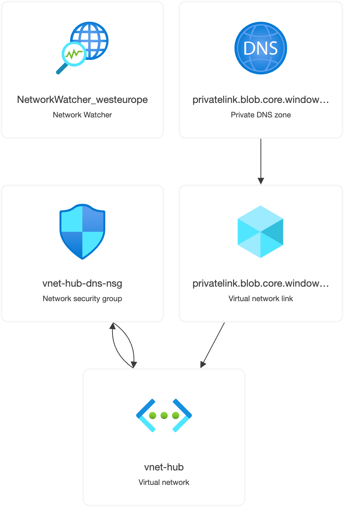
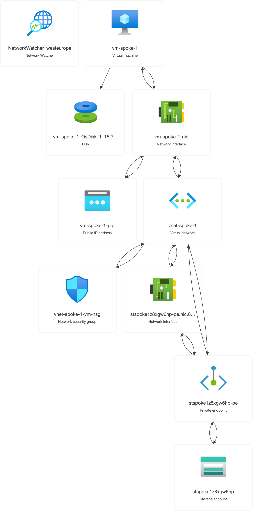

# Hub-Spoke Infrastructure Deployment Guide

This guide provides step-by-step instructions for deploying the hub-and-spoke infrastructure across multiple Azure subscriptions.

## Subscription Structure


The architecture spans multiple subscriptions as shown above:
- **Work_Subscription_A**: Contains the hub infrastructure
- **Spoke_1**: Contains the first spoke with VM and storage
- Additional spokes can be added following the same pattern

## Prerequisites

### Required Tools
- [Azure CLI](https://docs.microsoft.com/en-us/cli/azure/install-azure-cli) (version 2.30+)
- [Terraform](https://www.terraform.io/downloads.html) (version 1.0+)
- SSH client
- jq (for JSON processing)

### Azure Requirements
- Two Azure subscriptions (hub and spoke)
- Appropriate RBAC permissions in both subscriptions:
  - `Owner` or `Contributor` + `User Access Administrator`
  - Permission to create policy assignments
- Service Principal with cross-subscription access (recommended)

### Network Planning
- **Hub VNet**: `10.0.0.0/16`
  - Gateway Subnet: `10.0.1.0/24`
  - DNS Subnet: `10.0.2.0/24`
- **Spoke VNet**: `10.1.0.0/16`
  - VM Subnet: `10.1.1.0/24`
  - Storage Subnet: `10.1.2.0/24`

## Step 1: Initial Setup

### 1.1 Clone and Prepare Project
```bash
git clone <repository-url>
cd azure-private-link-hub-spoke

# Generate SSH key for VM access
./scripts/generate-ssh-key.sh
```

### 1.2 Configure Authentication
```bash
# Login to Azure
az login

# List available subscriptions
az account list --output table

# Set default subscription to hub
az account set --subscription "Work_Subscription_A"
```

### 1.3 Create Service Principal (Recommended)
```bash
# Create service principal with contributor access to both subscriptions
az ad sp create-for-rbac --name "hub-spoke-terraform" \
  --role "Contributor" \
  --scopes "/subscriptions/HUB_SUBSCRIPTION_ID" \
           "/subscriptions/SPOKE_SUBSCRIPTION_ID"

# Note down the output for later use
```

## Step 2: Deploy Hub Infrastructure



The hub infrastructure creates the core networking components shown above, including the Network Watcher, private DNS zone, virtual network, and network security group that form the foundation of the hub-and-spoke architecture.

### 2.1 Configure Hub Variables
```bash
cd environments/hub
cp terraform.tfvars.example terraform.tfvars
```

Edit `terraform.tfvars` with your values:
```hcl
# Subscription Configuration
hub_subscription_id = "your-hub-subscription-id"

# Spoke Subscription Configuration (for policies)
spoke_subscription_ids = {
  spoke-1 = "your-spoke-1-subscription-id"
}

# Network Configuration
location                        = "West Europe"
hub_resource_group_name        = "rg-hub-network"
hub_vnet_name                  = "vnet-hub"
hub_vnet_address_space         = ["10.0.0.0/16"]
gateway_subnet_address_prefix  = ["10.0.1.0/24"]
dns_subnet_address_prefix      = ["10.0.2.0/24"]

# DNS Configuration
enable_all_privatelink_zones = true  # Enterprise: all 25+ zones, Dev: false for blob only

# Initially disable peering (enable after spoke deployment)
enable_spoke_peering   = false
enable_spoke_dns_link  = false

# Policy Configuration
enable_tagging_policy = false  # Set to true to enforce resource tagging

# Tags
tags = {
  Environment = "production"
  Project     = "hub-spoke-infrastructure"
  ManagedBy   = "terraform"
  Owner       = "platform-team"
}
```

### 2.2 Deploy Hub
```bash
# Initialize and deploy hub infrastructure
./deploy.sh
```

### 2.3 Note Hub Outputs
Save the following outputs for spoke configuration:
- `hub_vnet_id`
- `private_dns_zone_id` (backward compatibility)
- `private_dns_zones` (all zones if comprehensive coverage enabled)
- `hub_resource_group_name`

```bash
# View all outputs
terraform output

# View specific DNS zones created
terraform output private_dns_zones
```

## Step 3: Deploy Spoke Infrastructure



The spoke infrastructure diagram above shows the complete resource topology, including the VM, network interfaces, public IP, VNet, network security group, private endpoint, and storage account that work together to provide secure, private access to storage services.

### 3.1 Configure Spoke Variables
```bash
cd ../spoke-1
cp terraform.tfvars.example terraform.tfvars
```

Edit `terraform.tfvars` with your values:
```hcl
# Subscription Configuration
spoke_subscription_id   = "your-spoke-1-subscription-id"
hub_subscription_id     = "your-hub-subscription-id"

# Hub References (from hub outputs)
hub_resource_group_name = "rg-hub-network"
hub_vnet_name          = "vnet-hub"

# Network Configuration
location                 = "West Europe"
spoke_vnet_address_space = ["10.1.0.0/16"]
vm_subnet_address_prefix      = ["10.1.1.0/24"]
storage_subnet_address_prefix = ["10.1.2.0/24"]

# Security
admin_source_address_prefix = "YOUR_PUBLIC_IP/32"  # Replace with your IP

# VM Configuration
vm_name               = "vm-spoke-1"
admin_username        = "azureuser"
admin_ssh_public_key  = "ssh-rsa AAAAB3..."  # From generate-ssh-key.sh output
enable_public_ip      = true

# Storage
storage_account_prefix = "stspoke1"
container_name        = "data"
```

### 3.2 Deploy Spoke
```bash
# Deploy spoke infrastructure
./deploy.sh
```

### 3.3 Note Spoke Outputs
Save the `spoke_vnet_id` for hub peering configuration.

## Step 4: Establish Cross-Subscription Peering

### 4.1 Automated Peering Setup
```bash
# Run automated peering setup script
cd ../../scripts
./setup-peering.sh
```

### 4.2 Manual Peering Setup (Alternative)
If the automated script fails, configure manually:

```bash
cd ../environments/hub

# Update terraform.tfvars
spoke_vnet_id = "/subscriptions/SPOKE_SUB_ID/resourceGroups/rg-spoke-1/providers/Microsoft.Network/virtualNetworks/vnet-spoke-1"
enable_spoke_peering = true
enable_spoke_dns_link = true

# Re-apply hub configuration
terraform plan
terraform apply
```

## Step 5: Verify Deployment

### 5.1 Test Storage Connectivity
```bash
cd scripts
./test-storage-access.sh
```

This script will:
- Connect to the VM via SSH
- Test managed identity authentication
- Verify private DNS resolution
- Test blob storage operations

### 5.2 Manual Verification
Connect to the VM and test manually:
```bash
# Get VM IP from spoke outputs
ssh azureuser@<vm-public-ip>

# Test storage helper script
./storage-helper.sh upload /tmp/test.txt test.txt
./storage-helper.sh list
./storage-helper.sh download test.txt /tmp/downloaded.txt
./storage-helper.sh delete test.txt

# Test DNS resolution
nslookup stspoke1xxxxx.blob.core.windows.net
# Should resolve to private IP (10.1.2.x)

# Test Azure CLI with managed identity
az login --identity
az storage blob list --account-name stspoke1xxxxx --container-name data --auth-mode login
```

## Step 6: Policy Verification

### 6.1 Test Policy Enforcement
Try creating a privatelink DNS zone in the spoke subscription:
```bash
# Switch to spoke subscription
az account set --subscription "your-spoke-1-subscription-id"

# This should be denied by policy
az network private-dns zone create \
  --resource-group rg-spoke-1 \
  --name privatelink.database.windows.net
```

### 6.2 Test Allowed DNS Zone Creation
```bash
# This should be allowed
az network private-dns zone create \
  --resource-group rg-spoke-1 \
  --name internal.difu.com
```

### 6.3 Test Automated DNS Record Creation
Create a private endpoint and verify automatic DNS record creation:
```bash
# Create a test Key Vault with private endpoint
az keyvault create --name kv-test-spoke1 --resource-group rg-spoke-1 --location "West Europe"

# Create private endpoint (triggers policy)
az network private-endpoint create \
  --name pe-keyvault-test \
  --resource-group rg-spoke-1 \
  --vnet-name vnet-spoke-1 \
  --subnet storage-subnet \
  --private-connection-resource-id "/subscriptions/.../vaults/kv-test-spoke1" \
  --group-ids vault \
  --connection-name keyvault-connection

# Check if DNS record was automatically created in hub
az account set --subscription "your-hub-subscription-id"
az network private-dns record-set a list \
  --zone-name privatelink.vaultcore.azure.net \
  --resource-group rg-hub-network
```

## Architecture Validation

After successful deployment, verify:

✅ **Network Connectivity**
- Hub and spoke VNets are peered
- Cross-subscription communication works
- No internet routing for private traffic

✅ **DNS Resolution**
- Storage account resolves to private IP
- Private DNS zone linked to spoke VNet
- Centralized DNS management in hub

✅ **Security**
- VM uses managed identity for storage access
- Storage account blocks public access
- Private endpoint provides secure connectivity

✅ **Policy Governance**
- Spoke cannot create privatelink DNS zones
- Spoke can create other private DNS zones
- Centralized policy management
- Automatic DNS record creation for private endpoints
- Policy-driven DNS lifecycle management

## Troubleshooting

### Common Issues

1. **Cross-subscription permissions**
   ```bash
   # Verify service principal permissions
   az role assignment list --assignee <service-principal-id>
   ```

2. **DNS resolution issues**
   ```bash
   # Check private DNS zone links
   az network private-dns link vnet list --zone-name privatelink.blob.core.windows.net --resource-group rg-hub-network
   ```

3. **Storage access denied**
   ```bash
   # Verify managed identity role assignment
   az role assignment list --scope /subscriptions/.../resourceGroups/rg-spoke-1/providers/Microsoft.Storage/storageAccounts/...
   ```

### Logs and Diagnostics
- Check VM boot diagnostics in Azure portal
- Review cloud-init logs: `/var/log/cloud-init-output.log`
- Test network connectivity: `telnet storage-account.blob.core.windows.net 443`

## Cleanup

To destroy the infrastructure:
```bash
# Destroy spoke first
cd environments/spoke-1
terraform destroy

# Then destroy hub
cd ../hub
terraform destroy
```

## Next Steps

- Add more spokes using the same pattern
- Implement Azure Firewall in hub for centralized security
- Add VPN Gateway for on-premises connectivity
- Configure monitoring and alerting
- Implement backup and disaster recovery