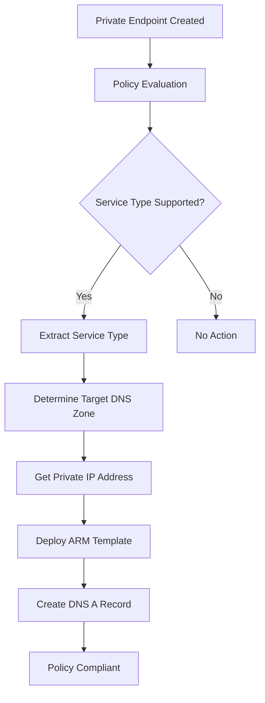

# Azure Policy Automation for Hub-Spoke DNS Management

This document details the automated policy framework that manages DNS records for private endpoints across the hub-spoke architecture.

## Overview

The infrastructure implements enterprise-scale Azure Policy automation following Microsoft Cloud Adoption Framework best practices for Private Link and DNS integration at scale.

### Policy Framework Components

1. **Deny Policies**: Prevent privatelink DNS zone creation in spokes
2. **DeployIfNotExists Policies**: Automate DNS record lifecycle management
3. **Managed Identity Integration**: Secure cross-subscription operations
4. **RBAC Automation**: Automatic role assignments for policy execution

## Policy Definitions

### 1. Deny Privatelink DNS Zones

**Purpose**: Enforces centralized DNS management by preventing spoke subscriptions from creating privatelink DNS zones.

**Policy Rule**:
```json
{
  "if": {
    "allOf": [
      {
        "field": "type",
        "equals": "Microsoft.Network/privateDnsZones"
      },
      {
        "field": "name", 
        "contains": "privatelink"
      }
    ]
  },
  "then": {
    "effect": "deny"
  }
}
```

**Scope**: All spoke subscriptions
**Effect**: Immediate denial of resource creation

### 2. Auto-Create Private Endpoint DNS Records

**Purpose**: Automatically creates DNS A records in hub private DNS zones when private endpoints are deployed in spoke subscriptions.

**Policy Rule Structure**:
```json
{
  "if": {
    "allOf": [
      {
        "field": "type",
        "equals": "Microsoft.Network/privateEndpoints"
      },
      {
        "field": "Microsoft.Network/privateEndpoints/privateLinkServiceConnections[*].groupIds[*]",
        "in": ["blob", "table", "queue", "file", "dfs", "sqlServer", "vault"]
      }
    ]
  },
  "then": {
    "effect": "deployIfNotExists",
    "details": {
      "type": "Microsoft.Network/privateDnsZones/A",
      "deployment": {
        "properties": {
          "mode": "incremental",
          "template": {
            // ARM template for DNS record creation
          }
        }
      }
    }
  }
}
```

## Supported Services

The DeployIfNotExists policy currently supports automatic DNS record creation for:

### Storage Services
- **blob**: `privatelink.blob.core.windows.net`
- **table**: `privatelink.table.core.windows.net`
- **queue**: `privatelink.queue.core.windows.net`
- **file**: `privatelink.file.core.windows.net`
- **dfs**: `privatelink.dfs.core.windows.net`

### Database Services
- **sqlServer**: `privatelink.database.windows.net`

### Security Services
- **vault**: `privatelink.vaultcore.azure.net`

### Extensibility
Additional services can be supported by:
1. Adding service group IDs to the policy condition
2. Extending the DNS zone mapping logic
3. Ensuring the target DNS zone exists in the hub

## Policy Assignment and Execution

### Assignment Scope
- **Target**: Spoke subscriptions
- **Assignment Type**: Subscription-level policy assignment
- **Identity**: System-assigned managed identity per assignment

### Execution Flow


### Managed Identity Permissions

Each policy assignment creates a system-assigned managed identity with:

**Role**: `Private DNS Zone Contributor`
**Scope**: Hub subscription resource group containing DNS zones
**Permissions**:
- Read private DNS zones
- Create/update/delete DNS records
- Read private DNS zone virtual network links

```hcl
# Automatic role assignment per spoke subscription
resource "azurerm_role_assignment" "policy_dns_contributor" {
  for_each = var.spoke_subscription_ids

  scope                = "/subscriptions/${var.hub_subscription_id}/resourceGroups/${var.hub_resource_group_name}"
  role_definition_name = "Private DNS Zone Contributor"
  principal_id         = azurerm_subscription_policy_assignment.auto_create_private_endpoint_dns[each.key].identity[0].principal_id
}
```

## DNS Record Lifecycle Management

### Creation Process
1. **Trigger**: Private endpoint deployment in spoke subscription
2. **Detection**: Policy evaluates resource type and service groups
3. **Mapping**: Service type mapped to appropriate DNS zone
4. **Extraction**: Private IP address extracted from endpoint
5. **Creation**: DNS A record created with FQDN → Private IP mapping

### Record Format
```
Record Name: <private-endpoint-name>
Record Type: A
TTL: 3600 seconds
Value: <private-endpoint-private-ip>
Zone: <appropriate-privatelink-zone>
```

### Deletion Process
DNS records follow the private endpoint lifecycle:
- **Automatic Cleanup**: Records deleted when private endpoint is removed
- **Policy Compliance**: Ensures no orphaned DNS records
- **Error Handling**: Failed deletions logged for manual remediation

## Configuration and Deployment

### Variable Configuration
```hcl
# Enable policy automation
variable "hub_resource_group_name" {
  description = "Name of the hub resource group containing private DNS zones"
  type        = string
}

variable "policy_assignment_location" {
  description = "Location for policy assignments with managed identities"
  type        = string
  default     = "East US"
}
```

### Terraform Implementation
```hcl
# Policy assignment with managed identity
resource "azurerm_subscription_policy_assignment" "auto_create_private_endpoint_dns" {
  for_each = var.spoke_subscription_ids
  
  name                 = "auto-dns-records-${each.key}"
  description          = "Automatically creates DNS records for private endpoints in spoke subscription ${each.key}"
  policy_definition_id = azurerm_policy_definition.auto_create_private_endpoint_dns.id
  subscription_id      = each.value

  identity {
    type = "SystemAssigned"
  }

  location = var.policy_assignment_location

  parameters = jsonencode({
    hubResourceGroupName = {
      value = var.hub_resource_group_name
    }
  })
}
```

## Monitoring and Troubleshooting

### Policy Evaluation Monitoring
Monitor policy evaluation through:
- **Azure Activity Log**: Policy assignment activities
- **Resource Deployment History**: ARM template deployments
- **Policy Compliance Dashboard**: Assignment compliance status

### Common Issues and Resolutions

#### 1. DNS Record Not Created
**Symptoms**: Private endpoint created but no DNS record appears
**Possible Causes**:
- Service type not supported by policy
- Managed identity lacks permissions
- Target DNS zone doesn't exist
- Policy assignment not applied

**Resolution**:
```bash
# Check policy assignment
az policy assignment list --scope "/subscriptions/<spoke-subscription-id>"

# Verify managed identity permissions
az role assignment list --assignee <managed-identity-principal-id>

# Check target DNS zone exists
az network private-dns zone show --name privatelink.blob.core.windows.net --resource-group rg-hub-network
```

#### 2. Permission Denied Errors
**Symptoms**: Policy evaluation fails with authorization errors
**Possible Causes**:
- Missing role assignment
- Incorrect scope configuration
- Cross-subscription permission issues

**Resolution**:
```bash
# Re-apply role assignment
terraform apply -target=azurerm_role_assignment.policy_dns_contributor

# Verify cross-subscription permissions
az account set --subscription <hub-subscription-id>
az role assignment list --scope "/subscriptions/<hub-subscription-id>/resourceGroups/rg-hub-network"
```

#### 3. ARM Template Deployment Failures
**Symptoms**: Policy triggers but ARM deployment fails
**Possible Causes**:
- Invalid template syntax
- Resource naming conflicts
- Network connectivity issues

**Resolution**:
```bash
# Check deployment history
az deployment sub list --subscription-id <spoke-subscription-id>

# Review deployment details
az deployment sub show --name <deployment-name> --subscription-id <spoke-subscription-id>
```

### Diagnostic Commands
```bash
# List all policy assignments
az policy assignment list --disable-scope-strict-match

# Check policy definition
az policy definition show --name "auto-create-private-endpoint-dns"

# View policy compliance
az policy state list --filter "PolicyDefinitionName eq 'auto-create-private-endpoint-dns'"

# Check managed identity
az ad sp show --id <managed-identity-principal-id>
```

## Best Practices

### Security Considerations
1. **Least Privilege**: Managed identities have minimal required permissions
2. **Scope Limitation**: Policies scoped to specific subscriptions only
3. **Audit Trail**: All policy actions logged in Activity Log
4. **Regular Review**: Periodic review of policy assignments and effectiveness

### Operational Excellence
1. **Monitoring**: Set up alerts for policy compliance violations
2. **Automatin**: Use Terraform for consistent policy deployment
3. **Documentation**: Maintain runbooks for common scenarios

## Enterprise Integration

### Management Group Integration
For larger organizations, consider:
```hcl
# Policy assignment at management group level
resource "azurerm_management_group_policy_assignment" "auto_create_private_endpoint_dns" {
  name                 = "auto-dns-records-enterprise"
  management_group_id  = data.azurerm_management_group.spokes.id
  policy_definition_id = azurerm_policy_definition.auto_create_private_endpoint_dns.id
  
  identity {
    type = "SystemAssigned"
  }
}
```

### Integration with Azure Security Center
Policy compliance monitoring can be integrated with:
- Azure Security Center compliance dashboard
- Azure Monitor for alerting on policy violations
- Azure Sentinel for security investigation workflows

## Future Enhancements

TODO